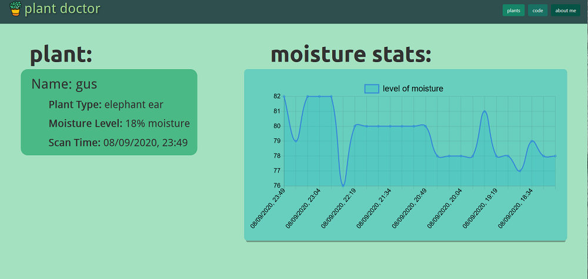

# Plant Doctor is here to save your dying plants!!

## an iot powered full stack app made with love

I am creating a web site where you can monitor the health of any plant! 
    - never forget to water your plant (or remember that it doesnt need any more water)
    - the application will be configurable to report on more than one plant, if needed

## Technologies used
- react.js 
- node.js & express
- python - for data collection and sqlite
- docker
- git (duh)
- sqlite

## Hardware Used 
- Rasberry Pi 4 - collects data and is my server
- Grove Sensor & Hat
- a plant that likes water ( pretty much any plant ... ah maybe not a cactus tho..)

In the project directory, you can run:

### `npm start`

Runs the app in the development mode. 
Open [http://localhost:3000](http://localhost:3000) to view it in the browser.

### `npm test`
Launches the test runner in the interactive watch mode. 

### `npm run build`
Builds the app for production to the `build` folder. 

